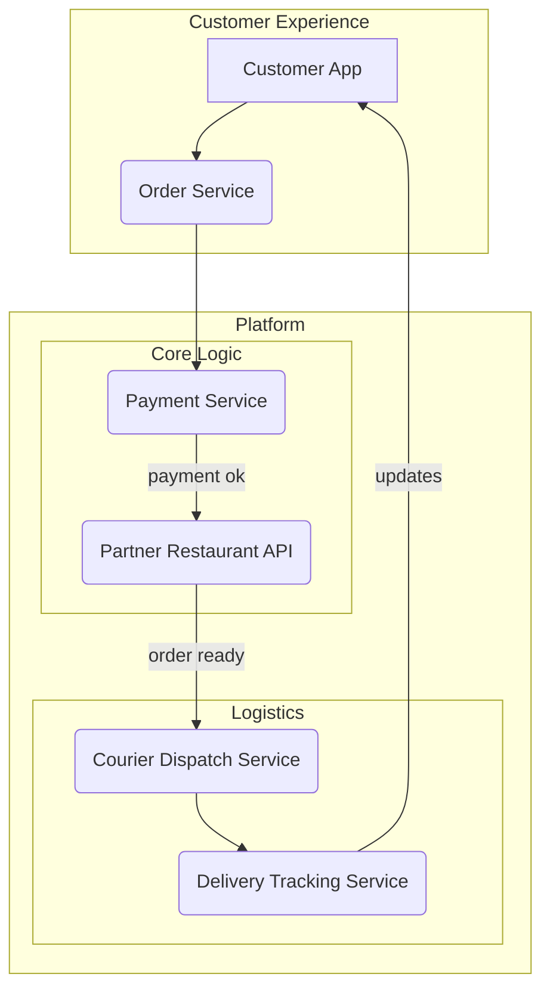
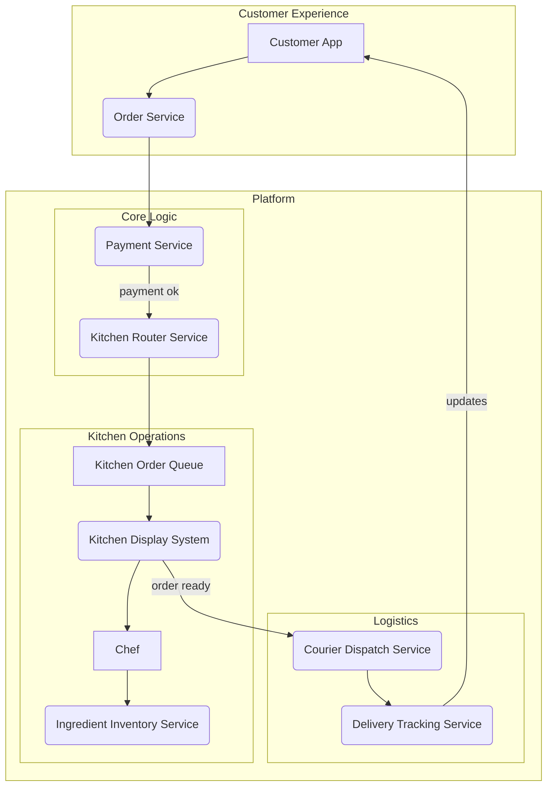
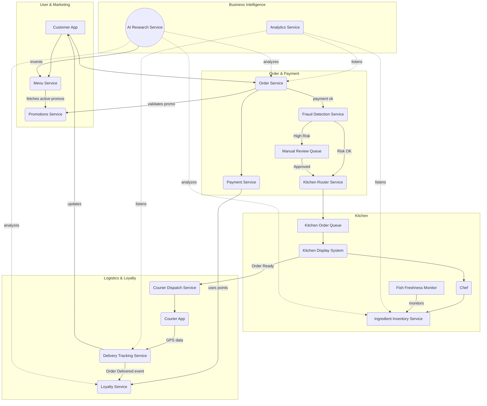
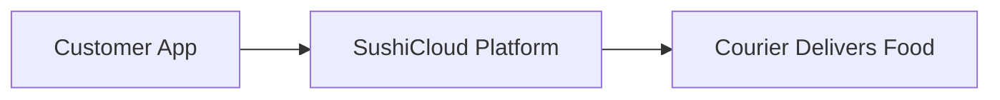
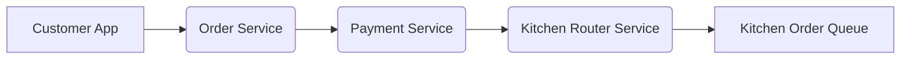
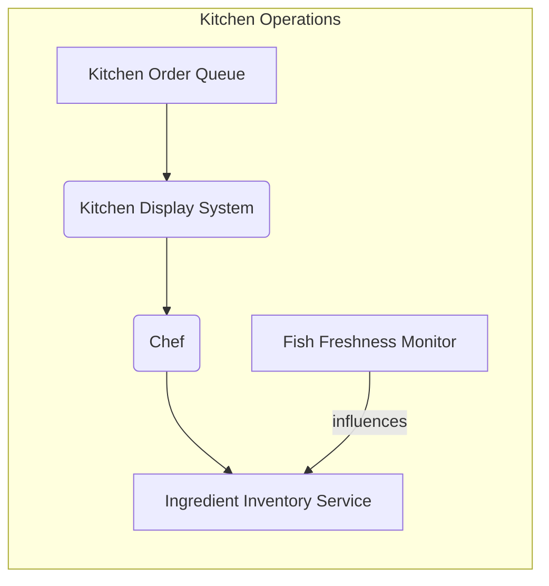
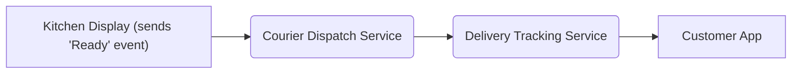
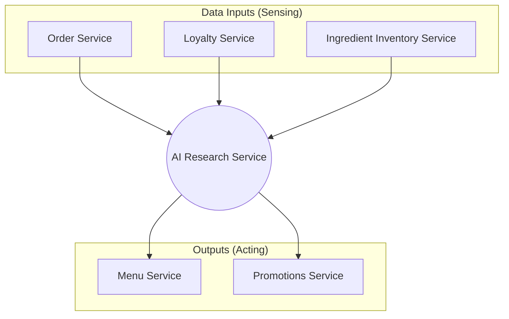



**TODO: Finish reviewing and editing**

A while back, I was reading a great blog post that broke down the complex
[internal architecture of
Temporal](https://medium.com/@sanilkhurana7/system-design-series-a-step-by-step-breakdown-of-temporals-internal-architecture-52340cc36f30),
and the author said something that resonated with me:

> It's impossible to understand the entirety of its architecture by just
> creating a huge diagram and copy-pasting it here, so I’ll walk through
> step-by-step, peeling the layers of its complexity one by one.

As someone who likes to draw system diagrams, I've often had similar thoughts.
Whenever I start to diagram something, it always feels nice and clean at the
outset. But as I add more and more components, there is a point where the
diagram begins to feel less helpful and more overwhelming.

In other words: **the bigger a diagram gets, the less useful it becomes**.

As engineers, we have an instinct to be comprehensive. We want our documentation
to be a perfect, 1:1 representation of reality. But diagrams aren't code for a
machine; they're communication tools for humans. Their primary goal isn't to be
exhaustive, but to **simplify complexity**.

To illustrate this, let's invent a fictional company, trace its journey from a
simple startup to a complex enterprise, and see how our system diagram evolves
along the way.

### SushiCloud 1.0: MVP phase

In its humble beginnings, 🍣☁️ **SushiCloud** is just a delivery aggregator,
setting out to be a sushi-specific version of DoorDash. We partner with local
sushi restaurants, list their menus in our app, and handle the logistics of
ordering and delivery.

The product is essentially just a customer-facing app with a system that
coordinates orders with restaurants and couriers. At this stage, we can create a
single diagram that shows the entire lifecycle of an order, and it's perfectly
clear:

This works! It's comprehensive, but because the system is simple, it's not
overwhelming. Anyone on our team can look at this and understand how an order
flows from the customer to the restaurant and then to their door.

### Phase 2: bringing kitchens in-house

The MVP is a hit, and SushiCloud raises a Series A. It's time to level up by
building our own distributed network of "cloud kitchens." This will give us
control over the quality of the food and allow for better profit margins.

This is a major change. We no longer talk to partner restaurants. Instead, we
have to manage a complex internal workflow where we route orders to the right
kitchen, track food preparation, and manage ingredient inventory.

Let's update our diagram to reflect the new reality:

Our architecture is a little more complicated now, but nevertheless, the story
is still easy to follow. We can clear see the linear flow from the customer,
through payment, into kitchen operations, and out to delivery. It's a little
more complex, but it still fits into a single, coherent diagram.

### Phase 3: hypergrowth and the "everything" diagram

Years go by. SushiCloud is now a massive success. To remain competitive, we've
had to add feature after feature. Along the way, our architecture has sprouted
new services: a **Promotions** service to run promo codes and time-boxed
discounts without touching core ordering logic; a **Loyalty** service to track
points/tiers and influence repeat purchases across channels; **Fraud Detection**
to score payments and route risky orders to manual review before capture; a
**Fish Freshness Monitor** to block recipes when ingredients are near expiry and
reduce refunds; an **Analytics** service to aggregate events into KPIs
(conversion, margin, prep time, delivery SLA); and even an **AI Research**
service to propose new sushi, run small experiments, and promote and retire
items based on profit.

Now, let's try to create that one, perfect, comprehensive diagram for the entire
system. The One Diagram to Rule Them All:

We've officially crossed the line. This diagram, while technically thorough, is
honestly a tangled mess. It's an exercise in frustration just trying to follow
the path of a single order. Our diagram fails to provide clarity on any single
part of the process. This is the pitfall of trying to maintain an "everything"
diagram.

### A better way: a suite of small diagrams

Instead of one giant map, let's create a collection of smaller, focused
diagrams. Each one tells a single, coherent story about one part of our
now-complex system.

#### Bird's-eye view

First, we need the highest-level view possible. This is our orientation map.

*   **Purpose:** To give anyone a basic, 30-second understanding of what the system does.

#### Placing an order

This diagram focuses on the initial transaction. Its story is, "How a customer's craving becomes a confirmed job for a kitchen."

*   **Purpose:** To explain the synchronous part of the ordering process and the handoff to the asynchronous world of the kitchen.

#### Making the sushi

This diagram focuses on the kitchen's internal operations. Its story is, "How the food is prepared."

*   **Purpose:** To show the workflow within a single cloud kitchen, isolated from the customer and the delivery logistics.

#### Delivery logistics

This diagram shows what happens after the food is ready. Its story is, "How the finished meal gets to the customer's door."

*   **Purpose:** To explain the handoff from the kitchen to the delivery network and the feedback loop to the customer.

#### AI-driven sushi R&D

Even our complex AI system can be documented with a small, clear diagram. Its story is, "How the platform invents new kinds of sushi."

*   **Purpose:** To explain how the AI learns from the system and acts upon it, without getting bogged down in the details of the customer order flow.

### Clarity over comprehensiveness

By breaking down our complex system into a suite of smaller, story-driven diagrams, we achieve clarity. Each diagram is easy to create, easy to understand, and easy to maintain. We lose the illusion of a single, comprehensive "source of truth," but we gain something far more valuable: genuine understanding.

The next time you need to explain a system, resist the urge to draw everything. Watch for the moment your diagram crosses the line from helpful to harmful. Start small, stay focused, and create clarity, not complexity.

# Comments?

Reply to [this Bluesky post][bluesky-post] with any comments, questions, etc.!

[bluesky-post]: https://bsky.app/profile/djy.io/post/FIXME
